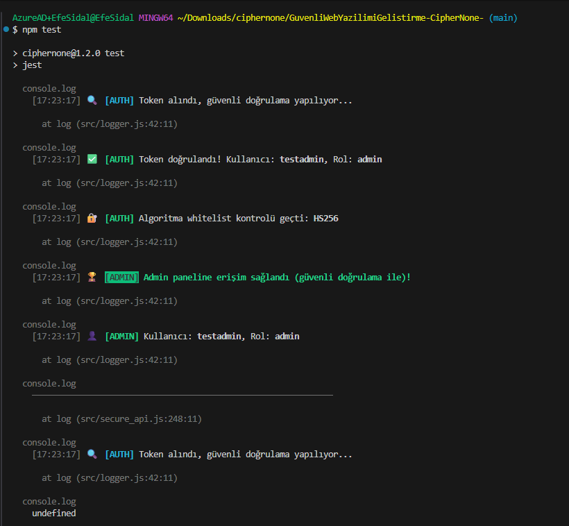
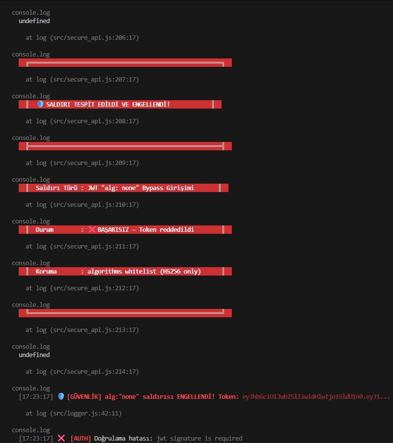
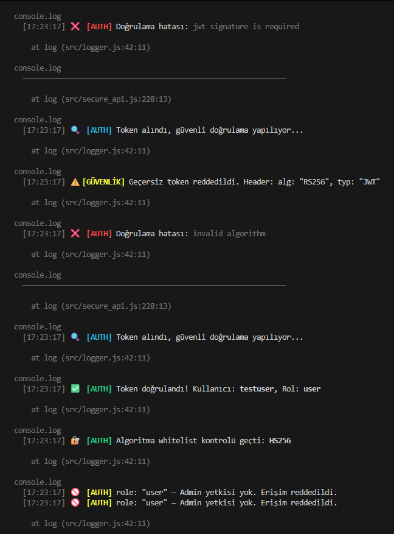
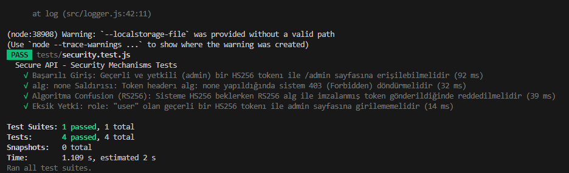

# 🛡️ CipherNone: JWT "alg: none" Vulnerability & Hardening Lab


[🇹🇷 Türkçe](#turkce) | [🇬🇧 English](#english)

---

<a id="turkce"></a>
## 🇹🇷 Türkçe

**CipherNone**, modern web mimarilerinde (REST API'ler) sıkça karşılaşılan kritik bir kimlik doğrulama zafiyetini (JWT Signature Bypass) uygulamalı olarak gösteren bir AppSec (Uygulama Güvenliği) laboratuvarıdır.

Bu projede saldırgan, JWT'nin header kısmındaki algoritmayı `alg: none` olarak değiştirip imza kısmını boş bırakarak yetki atlatma (Authentication Bypass) yapar. Proje, hem bu zafiyetin sömürülmesini (Exploitation) hem de mimari düzeyde nasıl yamalanacağını (Hardening) kanıtlarıyla sunar.

### 🚀 Proje İçeriği
* **`vulnerable_api.js` (Kurban):** Kasıtlı olarak "alg: none" kontrolünü yapmayan, imzasız token'ları kabul eden delik deşik bir Node.js API (Port: 3000).
* **`exploit.js` (Silah):** Herhangi bir kütüphane kullanmadan, tamamen sıfırdan sahte bir Base64Url JWT üreten ve kurban API'ye "Admin" yetkisiyle sızan saldırı scripti.
* **`secure_api.js` (Zırh):** Zero-Trust prensibiyle yazılmış, sadece `HS256` algoritmasını kabul eden ve sahte token'ları anında reddeden yamalı (Hardened) API (Port: 3001).

### 🛡️ Gelişmiş Güvenlik Özellikleri (Advanced Security Features)
* **Unit Tests**: Jest ve Supertest ile otomatik güvenlik doğrulama testleri entegre edildi.
* **Rate Limiting**: `express-rate-limit` ile Brute-Force saldırılarına karşı koruma katmanı eklendi.
* **HTTPS/TLS**: Tüm trafik Self-Signed SSL sertifikası ile uçtan uca şifrelendi.

### 🧪 Güvenlik Testlerini Çalıştırma
Uygulamanın şifreleme ve yetki güvenliklerini denetleyen otomatik test takımını koşturmak için:
```bash
npm test
```

### 📊 Test Kapsamı
Projede JWT güvenlik mekanizmalarını doğrulamak için Jest + Supertest ile 4 adet otomatik test yazıldı.

- ✅ Geçerli HS256 admin token ile /admin erişimi
- ✅ alg: none saldırısının tespiti ve engellenmesi
- ✅ Algorithm Confusion (RS256 alg + HS256 imza) saldırısının engellenmesi
- ✅ User rolü ile admin erişiminin reddedilmesi






### 🏭 Production İçin Geliştirme Önerileri
- JWT algoritması olarak HS256 yerine RS256 (asymmetric keys) kullanılması
- Düzenli key rotation mekanizması
- Short-lived access token + Refresh token sistemi
- Rate limiting’in production seviyesinde yapılandırılması
- Daha gelişmiş logging ve monitoring (Winston + Prometheus gibi)
- multi-stage Docker build ve non-root user kullanımı
- Gerçek SSL sertifikası (Let’s Encrypt) entegrasyonu

### 🔄 Refresh Token Sistemi (Yeni!)
Modern uygulamalarda güvenliği artırmak için eklenen **Refresh Token** demosu (`src/refresh_token_demo.js`):
- **Access Token (15 dk)**: Kısa ömürlü, her istekte gönderilen token.
- **Refresh Token (7 gün)**: Uzun ömürlü, sadece yeni Access Token almak için kullanılan token.
- **Revocation (Blacklist)**: Kullanıcı çıkış yaptığında (`/logout`), ilgili refresh token kara listeye alınır ve bir daha kullanılamaz.

**Demosunu Başlatmak İçin:**
```bash
node src/refresh_token_demo.js
```
*(Port: 3002)*

### 🛠 Kullanım (PoC)

**1. Zafiyetli Sunucuyu Başlatın:**
```bash
node vulnerable_api.js
```

**2. Silahı Ateşleyin (Saldırı Aşaması):**

```bash
node exploit.js
```

*(Sonuç: Kurban API sahte token'ı yutar ve Admin yetkisi verir.)*

**3. Güvenli Sunucuyu Test Edin (Savunma Aşaması):**

```bash
node secure_api.js
```

*(`exploit.js` içindeki portu 3001 yapıp tekrar saldırın. Sonuç: 403 Forbidden - Saldırı Engellendi\!)*

-----

<a id="english"></a>

## 🇬🇧 English

**CipherNone** is an AppSec (Application Security) laboratory that practically demonstrates a critical authentication vulnerability commonly found in modern web architectures (REST APIs): the JWT Signature Bypass.

In this project, an attacker performs an Authentication Bypass by changing the algorithm in the JWT header to `alg: none` and leaving the signature empty. The project provides evidence for both the exploitation of this vulnerability and how to patch it (Hardening) at the architectural level.

### 🚀 Project Contents

  * **`vulnerable_api.js` (The Victim):** An intentionally flawed Node.js API that fails to check for "alg: none" and accepts unsigned tokens (Port: 3000).
  * **`exploit.js` (The Weapon):** An attack script that generates a forged Base64Url JWT entirely from scratch without any external libraries, bypassing the victim API with "Admin" privileges.
  * **`secure_api.js` (The Armor):** A hardened API built on Zero-Trust principles that strictly enforces the `HS256` algorithm and instantly rejects forged tokens (Port: 3001).

### 🛡️ Advanced Security Features
* **Unit Tests**: Automated security validation tests integrated using Jest and Supertest.
* **Rate Limiting**: Brute-force protection layer added via `express-rate-limit`.
* **HTTPS/TLS**: All traffic is end-to-end encrypted using a Self-Signed SSL certificate.

### 🧪 Running Automated Tests
To run the automated security tests verifying JWT protections and logic:
```bash
npm test
```

### 📊 Test Coverage
4 automated tests were written using Jest + Supertest to verify JWT security mechanisms in the project.

- ✅ Accessing /admin with a valid HS256 admin token
- ✅ Detection and prevention of the alg: none attack
- ✅ Prevention of the Algorithm Confusion (RS256 alg + HS256 signature) attack
- ✅ Rejection of admin access with the User role


### 🏭 Recommendations for Production Use
- Using RS256 (asymmetric keys) instead of HS256 as the JWT algorithm
- Regular key rotation mechanism
- Short-lived access token + Refresh token system
- Configuring rate limiting at a production level
- More advanced logging and monitoring (e.g., Winston + Prometheus)
- Multi-stage Docker build and non-root user implementation
- Real SSL certificate (Let's Encrypt) integration

### 🛠 Usage (PoC)

**1. Start the Vulnerable Server:**

```bash
node vulnerable_api.js
```

**2. Fire the Weapon (Exploitation Phase):**

```bash
node exploit.js
```

*(Result: The victim API swallows the forged token and grants Admin privileges.)*

**3. Test the Secure Server (Defense Phase):**

```bash
node secure_api.js
```

*(Change the port in `exploit.js` to 3001 and attack again. Result: 403 Forbidden - Attack Blocked\!)*
